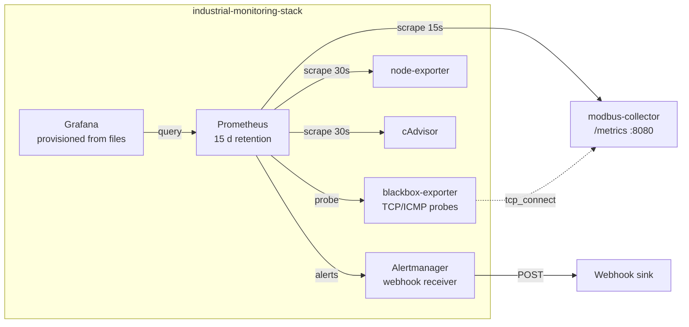

# industrial-monitoring-stack

[](../../actions/workflows/ci.yml)
[](LICENSE)

A reusable observability stack for **small industrial/OT deployments**:
Prometheus + Grafana + Alertmanager + exporters, pre-provisioned with
dashboards and alert rules tuned for telemetry workloads — few nodes,
always-on services, and questions like *"is the field talking to us?"* rather
than latency percentiles.

Works **standalone** (monitoring any Linux host + its Docker containers) and
**plugs into** the [`modbus-collector`](https://github.com/dscioli/modbus-collector)'s `/metrics`
(see [docs/INTEGRATION.md](docs/INTEGRATION.md)). Part of the AquaFlow
Regional Water Cooperative demo portfolio; the operator-facing counterpart is
[`pump-fleet-dashboard`](https://github.com/dscioli/pump-fleet-dashboard) — Grafana answers the
*engineering* questions (trends, correlations, infra health), the dashboard
is the *operator product*. Complementary, not redundant.

## Architecture



Everything is **provisioned from files** — datasource, dashboard providers,
dashboards, rules. `docker compose up` on a clean clone produces a working,
opinionated monitoring box with zero clicking.

## Quick start (standalone)

```bash
cp .env.example .env      # set GRAFANA_ADMIN_PASSWORD, optional webhook URL
docker compose up -d
```

| What | Where | Notes |
|---|---|---|
| Grafana | http://localhost:3000 | anonymous **viewer** access; admin password from `.env` |
| Prometheus | http://localhost:9090 | rules under Status → Rules |
| Alertmanager | http://localhost:9093 | webhook receiver, URL from `.env` |

Dashboards (folder **Industrial**):

- **Fleet status** — all stations at a glance: connectivity and pump state
  timelines, tank levels with threshold lines, active alerts, Modbus traffic
  rate, blackbox reachability.
- **Station overview** — one station deep-dive: online/last-seen/fault
  stats, the **raw vs filtered level** signature chart, pump state timeline,
  motor current.
- **Infra health** — host CPU/memory/disk/network + per-container CPU/memory
  (node-exporter + cAdvisor).

The telemetry panels light up when the collector job is reachable — see
[docs/INTEGRATION.md](docs/INTEGRATION.md) for the three ways to wire it
(combined demo, shared network, or edit the target). Until then they show
"no data"; the infra dashboards work immediately.

## Screenshots

<!-- Placeholders: capture from the running combined demo -->
| Fleet status | Station overview (raw vs filtered) | Infra health |
|---|---|---|
| _screenshot placeholder_ | _screenshot placeholder_ | _screenshot placeholder_ |

## Alert rules

Three groups, each rule with `summary`/`description` annotations and a
severity label (`page` / `warn` / `info`):

| Group | Rules |
|---|---|
| [`telemetry`](prometheus/rules/telemetry.rules.yml) | CollectorDown, StationOffline, TankLevelLow/High, **NoSamplesIngested**, PendingCommandsStuck, CollectorAlertActive |
| [`host`](prometheus/rules/host.rules.yml) | HostDown, HostDiskAlmostFull/Critical, HostLowMemory, HostSustainedHighCpu |
| [`containers`](prometheus/rules/containers.rules.yml) | ContainerRestarting, ContainerGone, ContainerOOMKilled, ContainerNearMemoryLimit |

Alertmanager groups by `(alertname, station)`, repeats every 4 h (24 h for
`info`), and carries two inhibitions: a dead collector silences all telemetry
alerts, and an offline station silences its own level/command alerts —
causes page, consequences don't.

## OT vs IT monitoring — why these defaults

In a web stack you page on latency percentiles and error rates; traffic is
the heartbeat. An OT telemetry box is the opposite: **traffic is tiny and
constant, so silence is the signal.** A station that stops talking, a
collector with no samples for 10 minutes, a flatlined sensor — these matter
more than any p99. Hence:

- **"No data" rules are page-severity** (`StationOffline`,
  `NoSamplesIngested`, `CollectorDown`) while resource pressure is mostly
  `warn` — a busy CPU degrades; a silent field is blind.
- **15 s scrape for telemetry, 30 s for infra.** Pump starts and fault bits
  live at control-loop timescales; hosts don't. Halving the infra rate is
  free headroom on a small box.
- **15 d retention.** The operational questions are "since last week"
  questions; long-term archival belongs to a proper TSDB tier (see below).
- **Long repeat intervals, tight grouping.** Small utilities have no on-call
  rotation; re-paging every 5 minutes trains people to ignore alerts.

## Configuration

- [`prometheus/prometheus.yml`](prometheus/prometheus.yml) — scrape jobs
  (self, node-exporter, cAdvisor, blackbox, `modbus-collector`).
- [`prometheus/rules/`](prometheus/rules/) — the three rule groups.
- [`alertmanager/alertmanager.yml`](alertmanager/alertmanager.yml) — routing,
  grouping, inhibition; webhook URL rendered from `ALERT_WEBHOOK_URL` at
  container start (Alertmanager cannot expand env vars itself).
- [`exporters/blackbox.yml`](exporters/blackbox.yml) — probe modules
  (`tcp_connect` default; `icmp` needs NET_RAW).
- [`grafana/`](grafana/) — provisioning (datasource, provider) + the three
  dashboards as JSON.

Env (`.env`): `GRAFANA_ADMIN_PASSWORD`, `GRAFANA_PORT`, `ALERT_WEBHOOK_URL`,
`TZ`. No other secrets exist in the stack.

## Scope: explicitly excluded (production notes)

- **Log aggregation (Loki)** — metrics only; add Loki + promtail when log
  search becomes a real need.
- **Long-term storage (Thanos/Mimir)** — 15 d local retention by design;
  federate or remote-write when history must outlive the box.
- **Kubernetes manifests** — this targets single-box Docker deployments,
  which is what small utilities actually run.
- **TLS / auth hardening** — for anything beyond a trusted LAN, put a
  reverse proxy with TLS + auth in front of Grafana/Prometheus, disable
  anonymous access, and firewall the exporter ports.

## License

[MIT](LICENSE)
